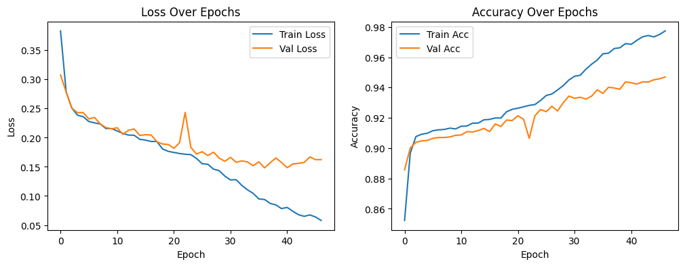
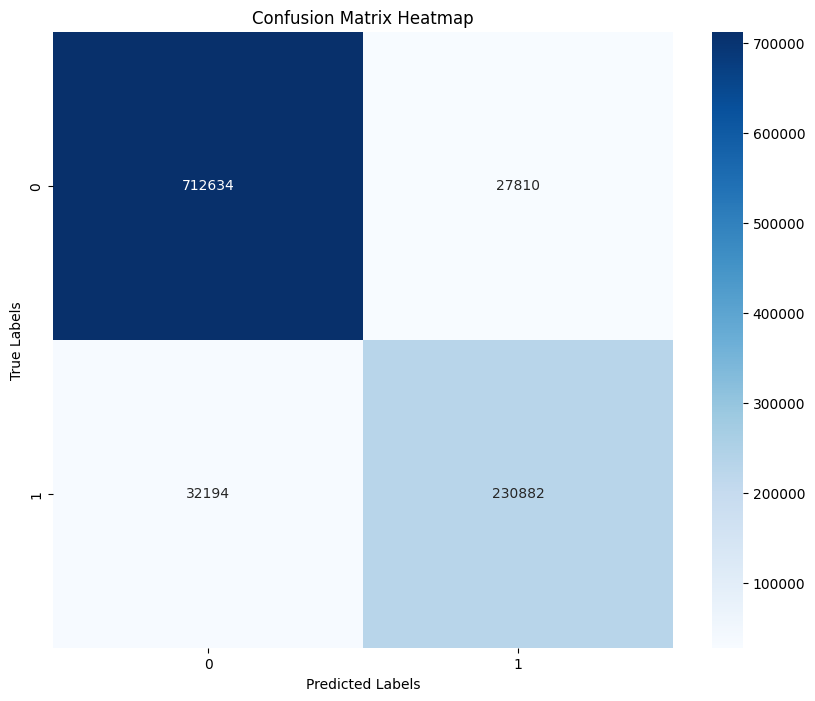
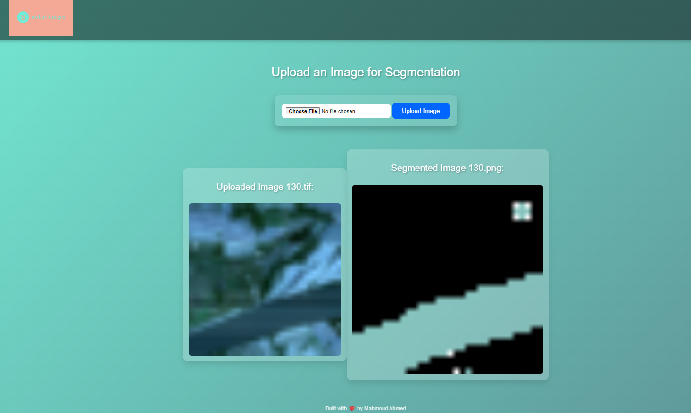

# Water Segmentation using Pretrained Models

This repository contains a Jupyter notebook that performs water segmentation using multispectral and optical data. The notebook leverages pretrained models to improve segmentation accuracy.

## Project Overview

The project focuses on segmenting water bodies from multispectral images. The main steps include:

1. **Data Preparation:**
   - Loading and organizing multispectral and optical data.
   - Preprocessing images and labels to ensure consistency.

2. **Modeling:**
   - Implementing a U-Net model for segmentation, incorporating pretrained encoders to enhance feature extraction.
   - The model is designed to handle multispectral images with 12 spectral bands.

3. **Training and Evaluation:**
   - The notebook includes steps for splitting the data into training and validation sets.
   - The model is trained and evaluated on this data to measure its performance.

## Requirements

The notebook is designed to run on Kaggle, where it uses specific data paths and GPU resources. The following libraries are required:

- `cv2`
- `rasterio`
- `numpy`
- `pandas`
- `matplotlib`
- `scikit-learn`
- `tifffile`

These libraries can be installed using the following command:

```bash
!pip install cv2 rasterio numpy pandas matplotlib scikit-learn tifffile
```

## Data
The data used in this project consists of multispectral and optical images, along with corresponding labels. The data should be organized in the following directory structure:

```bash

/data
    /images
    /labels
    /labelsAfterEdit
```


## Results
The notebook provides visualizations of the segmentation results, comparing the predicted masks with the ground truth labels.



## confusion matrix



## API Flask Implementation

The Flask API allows users to interact with the water segmentation model via a web interface. This implementation provides endpoints for uploading images and retrieving segmentation results.

### Features
- **Image Upload**: Users can upload multispectral images for segmentation.
- **Segmentation Results**: The API returns the segmented images as well as the original uploaded images.

### Setup

1. **Install Flask and Dependencies**

   Ensure you have Flask installed. You can install Flask and other required packages using pip:

   ```bash
   pip install Flask

## API Flask Implementation 



## Contributing
If you would like to contribute to this project, please fork the repository and submit a pull request with your changes.
